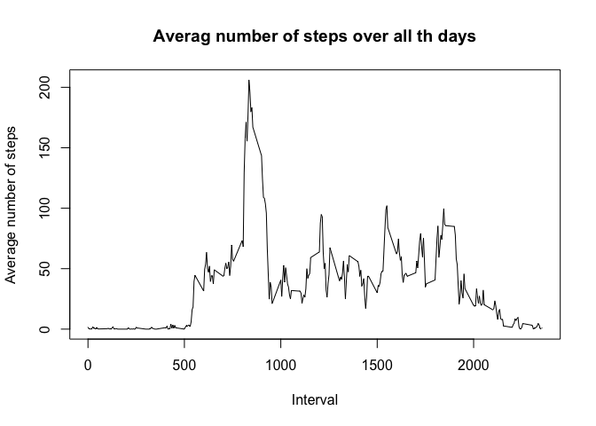
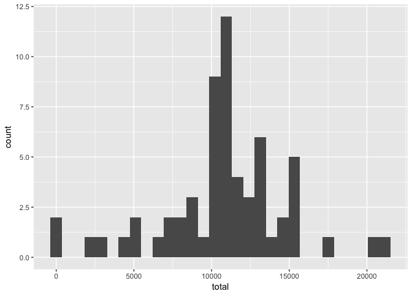

## Loading and preprocessing the data

```r
activity <- read.table("activity.csv", sep =",", header=TRUE)
summary(activity)
```

```
##      steps                date          interval     
##  Min.   :  0.00   2012-10-01:  288   Min.   :   0.0  
##  1st Qu.:  0.00   2012-10-02:  288   1st Qu.: 588.8  
##  Median :  0.00   2012-10-03:  288   Median :1177.5  
##  Mean   : 37.38   2012-10-04:  288   Mean   :1177.5  
##  3rd Qu.: 12.00   2012-10-05:  288   3rd Qu.:1766.2  
##  Max.   :806.00   2012-10-06:  288   Max.   :2355.0  
##  NA's   :2304     (Other)   :15840
```

```r
meaningful_steps <- activity[!is.na(activity$steps),]
meaningful_steps$date <- as.Date(meaningful_steps$date)
```

```
## Warning in strptime(xx, f <- "%Y-%m-%d", tz = "GMT"): unknown timezone
## 'zone/tz/2018c.1.0/zoneinfo/America/Los_Angeles'
```

```r
by_day <- group_by(meaningful_steps, date)
steps_by_day <- summarise(by_day, total = sum(steps))
summary(steps_by_day)
```

```
##       date                total      
##  Min.   :2012-10-02   Min.   :   41  
##  1st Qu.:2012-10-16   1st Qu.: 8841  
##  Median :2012-10-29   Median :10765  
##  Mean   :2012-10-30   Mean   :10766  
##  3rd Qu.:2012-11-16   3rd Qu.:13294  
##  Max.   :2012-11-29   Max.   :21194
```


## What is mean total number of steps taken per day?
Histogram of the steps per day:


```r
ggplot(steps_by_day, aes(total)) + geom_histogram()
```

```
## `stat_bin()` using `bins = 30`. Pick better value with `binwidth`.
```

<!-- -->

Mean of steps taken per day is 10,766 and median is 10,765.


## What is the average daily activity pattern?


###Time series Plot:

```r
steps_by_interval <- aggregate(steps ~ interval, meaningful_steps, mean)
plot(steps_by_interval$interval, steps_by_interval$steps, type = 'l', main = "Averag number of steps over all th days", xlab = "Interval", ylab = "Average number of steps")
```

<!-- -->


## Imputing missing values

Total number of NA:

```r
sum(is.na(activity$steps))
```

```
## [1] 2304
```

```r
impute_activity <- activity
impute_activity$steps[is.na(impute_activity$steps)] <- mean(impute_activity$steps, na.rm = T)
sum(is.na(impute_activity$steps))
```

```
## [1] 0
```

```r
impute_activity$date <- as.Date(impute_activity$date)
impute_by_day <- group_by(impute_activity, date)
impute_steps_by_day <- summarise(impute_by_day, total = sum(steps))
summary(impute_steps_by_day)
```

```
##       date                total      
##  Min.   :2012-10-01   Min.   :   41  
##  1st Qu.:2012-10-16   1st Qu.: 9819  
##  Median :2012-10-31   Median :10766  
##  Mean   :2012-10-31   Mean   :10766  
##  3rd Qu.:2012-11-15   3rd Qu.:12811  
##  Max.   :2012-11-30   Max.   :21194
```

```r
ggplot(impute_steps_by_day, aes(total)) + geom_histogram()
```

```
## `stat_bin()` using `bins = 30`. Pick better value with `binwidth`.
```

<!-- -->

Mean=Median after imputing.
Mean is 10,766 steps and median is 10,766 steps.

## Are there differences in activity patterns between weekdays and weekends?


```r
impute_activity$day <- weekdays(as.Date(impute_activity$date))
impute_activity$weekday[(impute_activity$day == "Saturday" | impute_activity$day == "Sunday")] <- "weekend"
impute_activity$weekday[!(impute_activity$day == "Saturday" | impute_activity$day == "Sunday")] <- "weekdays"
impute_activity$weekday <- as.factor(impute_activity$weekday)
summary(impute_activity)
```

```
##      steps             date               interval          day           
##  Min.   :  0.00   Min.   :2012-10-01   Min.   :   0.0   Length:17568      
##  1st Qu.:  0.00   1st Qu.:2012-10-16   1st Qu.: 588.8   Class :character  
##  Median :  0.00   Median :2012-10-31   Median :1177.5   Mode  :character  
##  Mean   : 37.38   Mean   :2012-10-31   Mean   :1177.5                     
##  3rd Qu.: 37.38   3rd Qu.:2012-11-15   3rd Qu.:1766.2                     
##  Max.   :806.00   Max.   :2012-11-30   Max.   :2355.0                     
##      weekday     
##  weekdays:12960  
##  weekend : 4608  
##                  
##                  
##                  
## 
```

```r
#time seires plot on 5 minute interval(x-axis) and avg number of steps taken, averaged across all weekdays or weekends.
ggplot(impute_activity, aes(interval, steps)) + geom_smooth(na.rm = TRUE) + facet_wrap(~weekday)
```

```
## `geom_smooth()` using method = 'gam'
```

<!-- -->
